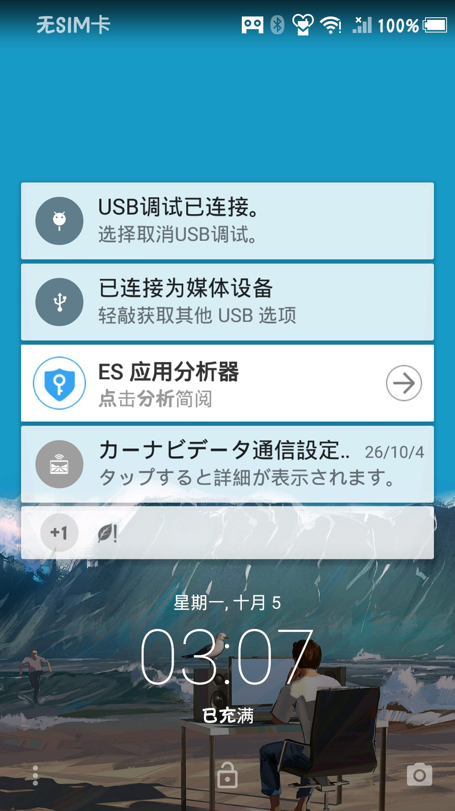

# 简阅 · JianYue

在 **Android 1.0（API Level 1，2008 年）** 上运行的联网阅读器：导入书源 → 搜索 → 看书。
纯 Java 从零实现，**无 Kotlin、无 AndroidX、无第三方 UI 库**——唯一例外是执行 `@js:` 书源
规则用的改造版 Rhino（见 `THIRD-PARTY.md`）。



已在三档真实环境端到端验证：Android 1.0 模拟器（API 1）、Android 4.1.2 模拟器（API 16）、
Android 5.0.2 真机（SHL25）。

## 为什么做这个

开源阅读（Legado）的 `minSdk` 是 21，2008 年的设备连装都装不上。本项目把「同一套书源规则
语义」压进 API 1：`minSdkVersion="1"`，`d8 --min-api 1`，编译时把 API 1 的 `android.jar`
当 `-bootclasspath`——这样任何在旧 Dalvik 上会炸的写法都会变成**编译错误**，而不是装机后才
发现的 VerifyError。

## 能做什么

| 功能 | 说明 |
|---|---|
| 导入书源 | 粘贴 JSON 或从文件导入；书源不内置，全部由使用者提供 |
| 联网搜索 | 多书源并行，同名书跨源合并成一行，显示来源与源数 |
| 详情 / 目录 / 正文 | 完整三级规则链；正文抓取失败会显式重试 |
| 换源 | 同名书按章序比例换算阅读进度 |
| 本地导入 | txt / epub / html，按字节偏移分章，读一章只 seek 一次 |
| 阅读页 | 只左右翻页；真实排版分页（见下）；三种字号；进度持久化 |
| 书源自检 | 规则语法自检、站点可达性探测、书源兼容性报告页 |

**刻意不做**：封面、网格书架、动画、听书/音频、图片书源。

## 安装

从 [Releases](../../releases) 下载 `jianyue-vX.Y.Z.apk`。

覆盖安装（升级）需要同时满足：**同包名 + 同签名 + versionCode 不降**。本项目的发布密钥固定，
每个版本的 `versionCode` 严格递增，所以直接安装新 APK 即可覆盖旧版本，书源与阅读进度都保留。

> ⚠️ **已知限制**：本 APK 未声明 `targetSdk`（按 Android 规则等同于 `minSdk` = 1）。
> **Android 14 及以上的系统会直接拒绝安装 `targetSdk < 23` 的应用**，这不是「允许安装未知来源」
> 能绕过的开关。也就是说这个包如今主要服务老设备；要让现代手机也能装，需要先做「抬升 targetSdk
> 到 23~27」的独立改造（保持 `minSdk=1` 不变），见 `docs/多版本兼容性矩阵.md`。

## 构建

需要一个 Windows 环境（脚本用 Windows PowerShell 5.1 编写）：

- **JDK 8**：`javac` 编译源码（`-source 8 -target 8`）
- **JDK 17**：`java` 跑 `d8`
- **Android SDK build-tools**：提供 `d8.jar` / `zipalign` / `apksigner`
- **`tools/sdk/`**：aapt v0.2、API 1 的 `android.jar`、改造版 Rhino —— 已随仓库分发，
  因为官方渠道都拿不到了（见 `tools/sdk/README.md`）

```powershell
Set-ExecutionPolicy -Scope Process Bypass

# 首次：填好签名配置（secrets.local.ps1 已被 .gitignore 排除，不会进仓库）
Copy-Item secrets.local.ps1.example secrets.local.ps1

.\build-reader.ps1
```

脚本会自己探测工具链：`tools/sdk/` → 环境变量（`JAVA_HOME_8_X64`、`JAVA_HOME_17_X64`、
`ANDROID_SDK_ROOT`）→ 开发机上的绝对路径。所以本地和 CI 跑的是同一个脚本，CI 见
`.github/workflows/release.yml`。

产物：

- `out/reader.apk` —— 验收脚本安装的就是这个路径，不要改名
- `out/jianyue-v<版本>.apk` —— 发布用，文件名自带版本号

构建流程：aapt 打包资源并生成 `R.java` → javac（API 1 的 jar 作 bootclasspath）→
`d8 --min-api 1` → 把 dex 注入 APK → zipalign → apksigner 签名 → `aapt dump badging`
断言版本号确实写进了 APK，并打印签名证书 SHA-256。

### 版本号规则

`version.txt` 是**唯一**写版本号的地方，`AndroidManifest.xml` 里故意不写（写了构建直接失败）。
`versionCode = MAJOR*10000 + MINOR*100 + PATCH`，即 1.0.0 → 10000、1.0.1 → 10001。
`versionCode` 只许升不许降——这是覆盖安装能生效的前提。

发版：改 `version.txt` → 提交 → `git tag v1.0.1 && git push origin v1.0.1`，
工作流校验 tag 与 version.txt 一致后自动构建并发布 Release。

## 项目结构

```
AndroidManifest.xml       版本号刻意不写在这里，见 version.txt
version.txt               版本号唯一来源
build-reader.ps1          构建脚本（无 Gradle）
src/com/jianyue/reader/
  net/                    Http（TLS 回退、超时）、NetKit
  rule/                   JsonPath / Html+CSS / XPathLite / Rules 规则分发 / Js（Rhino 桥）
  model/                  BookSource、Books、SourceStore、ProgressStore、SourceSwitcher
  engine/                 Engine：搜索/详情/目录/正文，唯一入口 evalRule()
  util/                   TextCodec（手写 UTF-8/GB2312）、TextSplitter、EpubExtractor、Paragraphs
  ui/                     三 tab 页 + 搜索/详情/阅读（Reader+Paginator）+ 自检页
res/                      自绘界面用到的图片与字符串
tools/                    图标生成、截图分析、各档验收脚本；tools/sdk 是构建依赖
docs/                     设计记录、书源格式说明、API 1 能力实测、多版本兼容性矩阵
.github/workflows/        打 tag 自动构建发布
```

## 几条硬约束（踩坑换来的）

- **规则解析只有一个入口**：`Engine.evalRule()` → `Rules.getString()`。搜索能出结果但目录为空，
  根因就是不同路径各写了一套解析，修了一处漏了另一处。
- **CSS 规则不写下标时合并所有匹配**（阅读的 `AnalyzeByJSoup` 语义），写下标才取单个。
- **不预测渲染结果**：分页不做 `Paint.breakText` 预测，而是把整章交给离屏 `TextView` 真实
  排版、按真实行首切页，每页再单独排一遍验证。任何"模拟渲染器"的代码都会在某个字号上分叉。
- **正文排版唯一入口** `util/Paragraphs`，网络书与本地书共用。
- **兼容性是单向的**：新系统能跑的写法老系统一般也能跑，风险全在"新框架加严"。
  凡改动离屏 View 或平台 API，三档设备各跑一遍才算通过。

更多：`docs/DEVELOPMENT.md`（开发细节）、`docs/多版本兼容性矩阵.md`、`docs/API1-能力实测记录.md`。

## 验收

三档设备各有一套脚本（`verify-on-api1.ps1`、`tools/verify-api16.ps1`、
`tools/verify-local-import.ps1` 等），断言的是 logcat 里的真实运行结果，不是「没崩就算过」。

注意：这些脚本写死了本机的设备序列号与书源路径，clone 之后需要自行调整。

## 书源

仓库**不内置任何书源**，也不提供、不托管任何书籍内容；书源由使用者自行提供。
书源 JSON 格式与规则写法见 `docs/书源JSON格式说明.md`。

## 与「开源阅读 / Legado」的关系

规则语义与界面观感参考自 [gedoor/legado](https://github.com/gedoor/legado)，但**代码是纯 Java
从零写的，没有复制其源码，本项目不是它的分支，与该团队没有隶属关系**。包名
`com.jianyue.reader`、日志 TAG、工程目录都自成一系，只在规则语义这个层面与它对齐。

## 许可

[GPL-3.0](LICENSE)。第三方组件与参考来源见 [THIRD-PARTY.md](THIRD-PARTY.md)。
